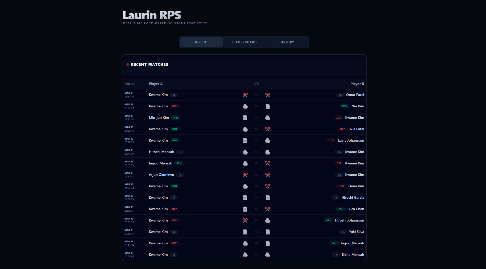
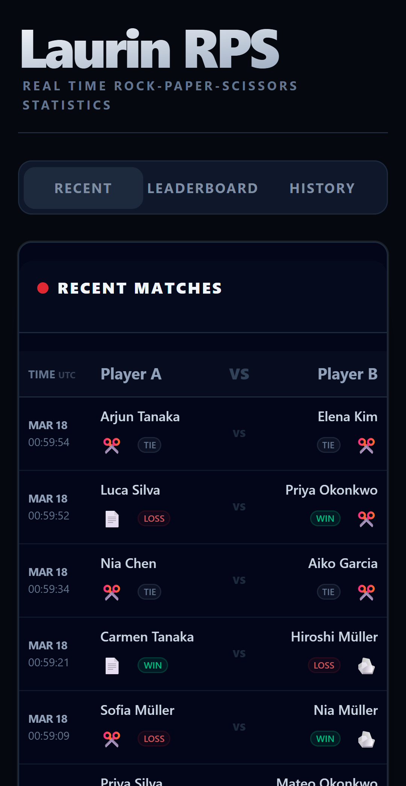
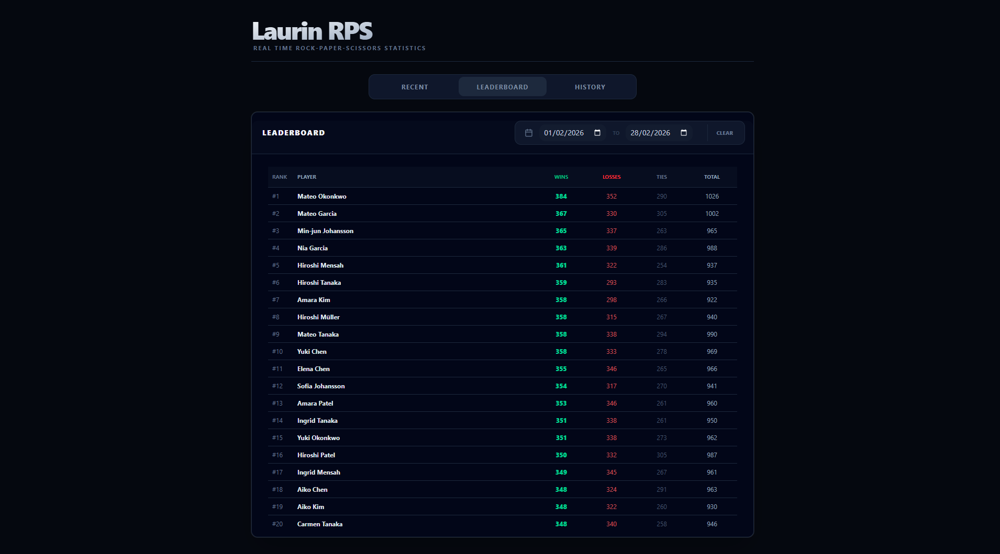
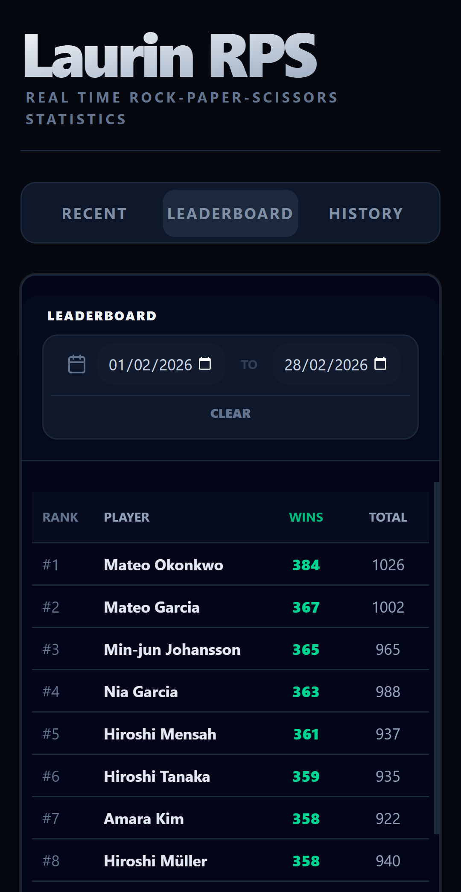
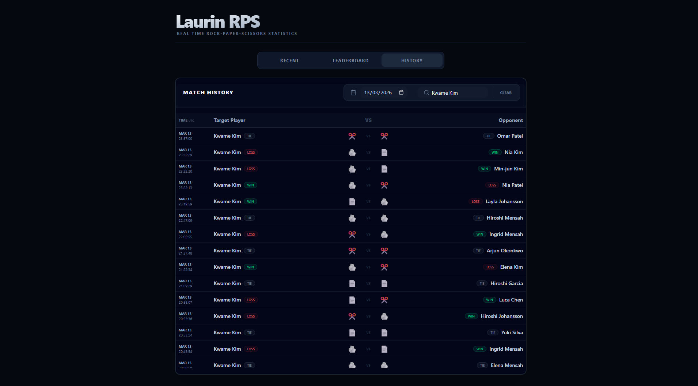
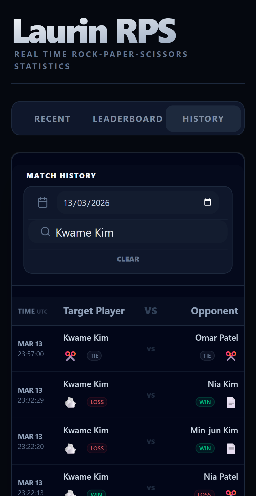

# Laurin RPS - Reaktor assignment

A Next.js web app for presenting Rock-Paper-Scissors matches fetched from Reaktor's Bad API. Stores matches in a Postgres database using Drizzle ORM.

The app was deployed to my k8s cluster found at [https://rps.laurimaila.com](https://rps.laurimaila.com), it'll work until end of May 2026.

## Screenshots

### Recent Matches
<table>
  <tr>
    <td></td>
    <td></td>
  </tr>
</table>

### Leaderboard
<table>
  <tr>
    <td></td>
    <td></td>
  </tr>
</table>

### Match History
<table>
  <tr>
    <td></td>
    <td></td>
  </tr>
</table>

## Tech Stack

- **Framework**: Next.js
- **Database**: Postgres with Drizzle ORM
- **Styling**: Shadcn & Tailwind

## Features

- **Recent Matches**: Shows a live updating list of RPS matches. A single backend service connects to Bad API and forwards new data to users. All times are shown in UTC.
- **Leaderboard**: Dynamic standings based on win counts, with support for custom date ranges. Shows leaderboard for current day by default.
- **Match History**: View the complete RPS match history or filter by date and/or player name.

- **Infinite Scroll**: Match history and leaderboard use cursor based pagination, so data is only fetched when needed.
- **Smart Sync**: A backend service crawls match history from Bad API and stops when it detects that the database is up-to-date, accounting for the fact that the API may arrive out of sequence.


## Architecture

### Match Service (`src/lib/match-service.ts`)
A singleton `EventTarget` class that coordinates data operations to specific modules:
- **Live Updates (`match-live.ts`)**: Maintains a persistent connection to Bad API and broadcasts new matches. Tries to reconnect after a while of receiving no data.
- **Historical Sync (`match-store.ts`)**: Manages the background process of crawling Bad API history and persisting data to Postgres.
- **Data Queries (`match-queries.ts`)**: Contains the database queries for fetching matches, searching players, and aggregating leaderboard statistics.

### Next.js API Layer (`src/app/api/`)
- `/api/live`: An SSE endpoint that streams new matches from the Match Service to users. Periodically sends heartbeat events to keep the connection open.
- `/api/history`: Handles paginated queries for match history with filtering.
- `/api/leaderboard`: Aggregates win/loss/tie statistics across the whole dataset or specific time windows.

## Docker Support

The project is containerized and can be ran locally using Docker Compose, after making `.env` file that has the required variables listed in `.env.example`.
```bash
docker compose up --build
```
